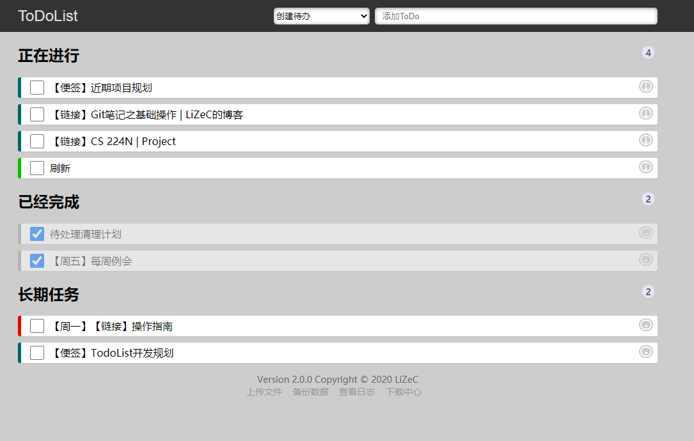

Smart-Todo 待办管理器
========================


Smart-Todo是一个简单智能的待办事项管理程序. Smart-Todo提供了创建和删除待办事项的基础功能, 并在此基础上自动优先级排序, 离线下载文件, 创建便签等重要的辅助功能.




- [Smart-Todo 待办管理器](#smart-todo-待办管理器)
  - [项目部署](#项目部署)
    - [方式一: 直接使用镜像](#方式一-直接使用镜像)
    - [方式二: 本地构建镜像后运行](#方式二-本地构建镜像后运行)
    - [部署说明](#部署说明)
  - [基本配置](#基本配置)
    - [配置日报推送](#配置日报推送)
  - [基础特性介绍](#基础特性介绍)
    - [截止日期](#截止日期)
    - [每日任务](#每日任务)
    - [每周任务](#每周任务)
    - [网页书签](#网页书签)
  - [自动优先级](#自动优先级)
    - [基础概念](#基础概念)
    - [截止日期](#截止日期-1)
    - [特定任务](#特定任务)
  - [文件控制](#文件控制)
    - [离线下载文件](#离线下载文件)
    - [本地上传文件](#本地上传文件)
    - [文件生命周期](#文件生命周期)
  - [Note系统](#note系统)
    - [自动保存](#自动保存)
    - [实现参考](#实现参考)
  - [开源项目和组件](#开源项目和组件)
  - [参考资料](#参考资料)
    - [Vue.js](#vuejs)
    - [JavaScript](#javascript)
    - [Font Awesome](#font-awesome)


项目部署
-------------

本项目已经支持Docker方式部署, 并且已经在Github提供的镜像托管服务`ghcr.io`上发布了此项目的镜像文件, 可根据需要在如下的两种部署方式种选择一种方式部署

### 方式一: 直接使用镜像

将如下的内容保存为`docker-compose.yml` 

```yml
version: '3.0'
services:
  todo:
    container_name: smart-todo
    image: ghcr.io/lizec123/smart-todo:latest
    environment:
      TZ: Asia/Shanghai
    ports: 
      - "8080:80"
    volumes:
      - ./config:/app/config
      - ./data:/app/data
      - /etc/localtime:/etc/localtime:ro
      - /etc/timezone:/etc/timezone:ro
```

执行如下命令拉取并运行服务

```bash
docker-compose up -d
```

### 方式二: 本地构建镜像后运行

如果无法访问`ghcr.io`, 则可以将此项目clone到本地后, 手动执行如下的命令在本地构建镜像

```
docker build . --file docker/Dockerfile --tag ghcr.io/lizec123/smart-todo
```
之后可以参考上一节的内容创建`docker-compose.yml`文件并启动服务.

### 部署说明

项目默认在8080端口提供服务, 可通过修改`docker-compose.yml`文件修改项目配置.


基本配置
-------------

本项目在config文件夹中提供了一个默认配置文件(`config/default.json`), 在本地运行或者测试时可以直接使用默认配置.

默认提供了两个测试用户, 信息如下

| 用户名  | 密码     | 权限                      |
| ------- | -------- | ------------------------- |
| `admin` | `123456` | `ROLE_ADMIN`, `ROLE_USER` |
| `user`  | `123456` | `ROLE_USER`               |

其中`user`用户仅拥有普通权限, 仅能够普通的使用系统的基本功能,
而`admin`用户具有管理员权限, 除了普通的使用系统外, 还可以查看系统日志, 执行特殊指令.

如果将项目部署在公网, 建议在config文件夹中创建`config.json`文件来覆盖原有配置. 
当`config.json`与`default.json`同时存在时, 优先加载`config.json`.


### 配置日报推送

一个完整的用户配置如下所示：

```json
    "user": {
      "password": "123456",
      "email": "user@example.com",
      "role": ["ROLE_USER"],
      "qw_hook": "https://qyapi.weixin.qq.com/cgi-bin/webhook/send?key=xxxx-xxxx"
    }
```

其中`email`字段和`qw_hook`字段可选填, 当`email`字段字段非空时, 用户的日报和周报会推送到该邮箱. 当`qw_hook`字段非空时, 用户的日报和周报会推送到该企业微信机器人.

关于企微微信机器人的配置, 可参考[官方文档](https://developer.work.weixin.qq.com/document/path/91770)


基础特性介绍
-------------

直接在标题栏输入代办事项的标题即可创建一个基础的代办事项.除此以外, 也支持使用如下的参数为代办事项附加额外的属性.

### 截止日期

在创建任意类型的任务时, 可以使用`-dl`参数来设置截止日期. 例如

```
写日记 -dl 11.12
周末会议 -dl 3.12:12
```
可以用`11.12`的方式指定日期为11月12日, 也可以使用`3.12:12`的方式将截止日期精确到3月12日中午12点.

如果不指定小时, 则默认为当天的零点, 不需要指定年份, 程序会自动推断未来一年内最接近的日期.

----------------------

除了明确指定某个日期以外, 还可以通过类似`W<N>`的方式指定截止时间为一周中的某一天. 例如

```
写日记 -dl W2
周末会议 -dl W5
```

如果当前是周三, 则W2表示下周二, W5表示本周五.

> 输入截止日期后, 将根据当前距离截止日期的远近程度, 对列表中的代办项目进行排序

### 每日任务

在创建任意类型的任务时, 可以使用`-re`参数来标记为每日任务. 例如

```
每日看论文 -re
```

> 每日任务在标记为完成状态后不会被垃圾收集, 并且在第二天会自动变为未完成状态.

### 每周任务

在创建任意类型的任务时, 可以使用`-sp`参数来设置每周的触发时间. 例如

```
周日任务 -sp 7
```

每日任务在标记为完成状态后不会被垃圾收集, 并且在下一周指定日期当前自动转换为待办状态.

> `-sp`后的数字表示一周的第几天, 1表示周一, 7表示周日


### 网页书签

在创建待办时, 如果输入一个URL, 则自动将此URL对应的页面的标题作为此待办的标题. 点击此待办事项可以直接跳转到输入的页面.

> 对Item右键可以按照Markdown格式复制标题和对应的URL


自动优先级
--------------

如果给定了必要的属性, 程序将自动对任务进行优先级排序.

### 基础概念

1. 两个不具有任何特殊属性的Item之间, 根据创建时间决定优先级, 创建时间越早, 优先级越高.
2. 所有的优先级算法都通过间接影响创建时间实现优先级的变化. 
3. 一个Item的优先级提高 1 天, 相当于比同时间提交的普通任务早 1 天提交.

自动优先级算法通过将Item的创建时间以及各种特殊属性影响的时间都转换为浮点数后相加得到总分值, 然后对总分值进行排序实现自动优先级.


### 截止日期

创建任务时, 可以设置截止日期. 系统将根据截止日期的远近进行排序. 规则如下

如果现在距离截止日期还有X天, 则任务优先级提高 (56 - 8X) 天

--------

根据截止日期与当前时间, 可以计算出urgent等级, 并依据等级在页面上使用不同的颜色预警. 规则如下

| 颜色 | 截止日期            |
| ---- | ------------------- |
| 红色 | 距离截止日期小于1天 |
| 橙色 | 距离截止日期小于2天 |
| 黄色 | 距离截止日期小于3天 |
| 蓝色 | 距离截止日期小于4天 |

-----------

此算法应该满足如下的约束条件

1. X>7时, 优先级降低
2. X=7时, 优先级不提高也不降低
3. X>3时, 优先级一定程度提高
4. X=3时, 优先级至少提高 30 天, 从而比工作任务优先展示
5. 函数应该尽可能平滑, 不存在间断点

> 使用线性插值是满足上述条件的最简单方案

### 特定任务 

特定任务在每周的特定的一天触发, 属于最高优先级的任务. 特定任务触发时, 会在当前时间的基础上将优先级提高 100 天


文件控制
------------

文件是一种特殊类型的Item, 点击文件类型的Item后, 会自动从服务器下载此文件.

### 离线下载文件

创建Item时选择下载文件类型, 输入需要下载的文件URL, 服务器将下载指定的文件, 并创建一个文件标记的Item.

> 如果没有选择下载文件类型, 则输入的URL会当做书签处理, 获取对应URL的标题
> 如果URL以特定文件扩展名结尾, 则会询问是否需要按照下载文件类型处理

### 本地上传文件

点击上传文件, 选择需要上传的文件, 文件将会上传到服务器, 并且生成一个文件标记的Item.

> 通过上传和下载可以实现文件中转功能

### 文件生命周期

- 无论是上传的文件还是下载的文件, 都与Item的生命周期绑定
- 当Item被删除时, 相应的文件同时被删除


Note系统
--------------

Note是一种特殊的Item, 创建完成后, 点击相应的Item会跳转到一个Note页面. 其中包含一个可以编辑的窗口, 可以通过此窗口输入任意的文本内容. 窗口支持基本的格式, 可以使用如下的快捷键

| 快捷键 | 效果       |
| ------ | ---------- |
| C+b    | 黑体       |
| C+i    | 斜体       |
| C+u    | 下划线     |
| C+d    | 删除线     |
| C+1    | 一级标题   |
| C+2    | 二级标题   |
| C+h    | 插入分割线 |

> 对于Win平台, C表示`Ctrl`键, 对于Mac和Linux平台, C表示`Ctrl`键或`Cmd`键

Note页面内可以继续创建Item, 此页面内创建的Item只在此页面可见. 借助于此功能, 可以将一个计划放入一个Note, 并逐步分解为Item.

当Note对应的Item被删除时, Note所包含的全部数据同时被删除(通过类似Java的引用分析来回收资源).

> 创建Item时, 如果名称中包含`计划`, `规划`等词汇, 也会询问用户是否要创建Note类型的Item

### 自动保存

在Note页面, 输入的内容会静默的执行自动保存, 每分钟保存一次. 也可以使用Ctrl+S手动保存.

### 实现参考

- [10行 JavaScript 实现文本编辑器](https://segmentfault.com/a/1190000008454793)
- [自己动手实现简易的div可编辑富文本框及按下tab键后增加4个空格功能](https://blog.csdn.net/Clark_Fitz817/article/details/79316037)


开源项目和组件
----------------

感谢以下的开源项目和免费组件:

- [网站ico图标来源](https://icon-library.com/icon/todo-list-icon-13.html)
- [svg转ico工具](https://www.aconvert.com/cn/icon/svg-to-ico/)

 
参考资料
--------------

### Vue.js
- [Vue.js——60分钟快速入门](https://www.cnblogs.com/keepfool/p/5619070.html)
- [使用 axios 访问 API](https://cn.vuejs.org/v2/cookbook/using-axios-to-consume-apis.html)

### JavaScript

- [使用 Web Notifications](https://developer.mozilla.org/zh-CN/docs/Web/API/Notifications_API/Using_the_Notifications_API)

### Font Awesome

- [Font Awesome图标查询](https://fontawesome.com/v5.15/icons?d=gallery&p=2&s=regular,solid&m=free)
- [Vue中使用Font Awesome](https://github.com/FortAwesome/vue-fontawesome)
