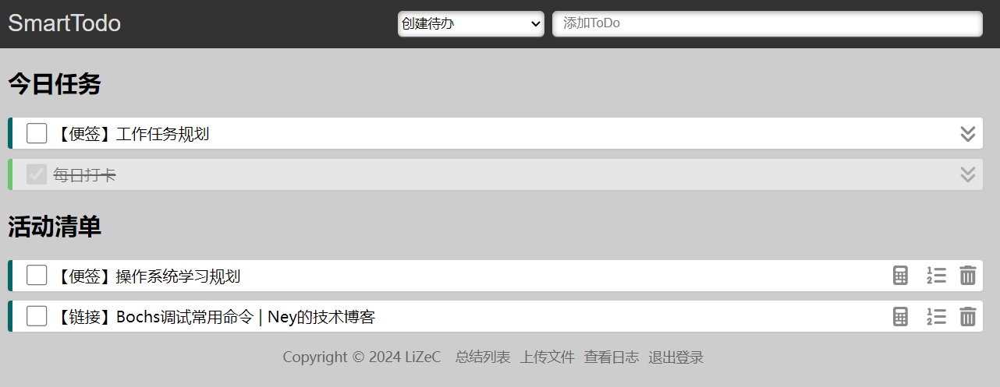

Smart-Todo 待办管理器
========================


Smart-Todo是一个简单智能的待办事项管理程序. Smart-Todo提供了创建和删除待办事项的基础功能, 并在此基础上自动优先级排序, 离线下载文件, 创建便签等重要的辅助功能.




- [Smart-Todo 待办管理器](#smart-todo-待办管理器)
  - [项目部署](#项目部署)
    - [本地构建镜像](#本地构建镜像)
    - [部署说明](#部署说明)
  - [基本配置](#基本配置)
    - [配置日报推送](#配置日报推送)
  - [基础特性介绍](#基础特性介绍)
    - [截止日期](#截止日期)
    - [每日任务](#每日任务)
    - [周期任务](#周期任务)
    - [网页书签](#网页书签)
    - [垃圾回收](#垃圾回收)
  - [番茄工作法](#番茄工作法)
  - [自动优先级](#自动优先级)
    - [基础概念](#基础概念)
    - [截止日期](#截止日期-1)
    - [特定任务](#特定任务)
  - [文件控制](#文件控制)
    - [离线下载文件](#离线下载文件)
    - [本地上传文件](#本地上传文件)
    - [文件生命周期](#文件生命周期)
  - [Note系统](#note系统)
    - [自动保存](#自动保存)
    - [实现参考](#实现参考)
  - [指令系统](#指令系统)
  - [开源项目和组件](#开源项目和组件)
  - [参考资料](#参考资料)
    - [Vue.js](#vuejs)
    - [JavaScript](#javascript)
    - [Font Awesome](#font-awesome)
    - [音效素材](#音效素材)


项目部署
-------------

本项目已经支持Docker方式部署, 并且已经在Github提供的镜像托管服务`ghcr.io`上发布了此项目的镜像文件. 当前可使用docker-compose一键部署, 将如下的内容保存为`docker-compose.yml` 

```yml
version: '3.0'
services:
  todo:
    container_name: smart-todo
    image: ghcr.io/lizec123/smart-todo:latest
    environment:
      TZ: Asia/Shanghai
    ports: 
      - "8080:80"
    volumes:
      - ./config:/app/config
      - ./data:/app/data
      - /etc/localtime:/etc/localtime:ro
      - /etc/timezone:/etc/timezone:ro
```

执行如下命令即可拉取并在后台运行服务

```bash
docker-compose up -d
```

### 本地构建镜像

如果无法访问`ghcr.io`, 则可以将此项目clone到本地后, 手动执行如下的命令在本地构建镜像

```
docker build . --file docker/Dockerfile --tag ghcr.io/lizec123/smart-todo
```

镜像构建成功后, 可继续使用上述的`docker-compose.yml`文件启动服务. 此时由于本地已存在目标镜像, 将会自动使用本地的镜像.

### 部署说明

项目默认在8080端口提供服务, 可通过修改`docker-compose.yml`文件修改项目配置. 


基本配置
-------------

本项目在config文件夹中提供了一个默认配置文件(`config/default.json`), 在本地运行或者测试时可以直接使用默认配置.

默认提供了两个测试用户, 信息如下

| 用户名  | 密码     | 权限                      |
| ------- | -------- | ------------------------- |
| `admin` | `123456` | `ROLE_ADMIN`, `ROLE_USER` |
| `user`  | `123456` | `ROLE_USER`               |

其中`user`用户仅拥有普通权限, 仅能够普通的使用系统的基本功能,
而`admin`用户具有管理员权限, 除了普通的使用系统外, 还可以查看系统日志, 执行特殊指令.

如果将项目部署在公网, 建议在config文件夹中创建`config.json`文件来覆盖原有配置. 
当`config.json`与`default.json`同时存在时, 优先加载`config.json`.


### 配置日报推送

一个完整的用户配置如下所示：

```json
    "user": {
      "password": "123456",
      "email": "user@example.com",
      "role": ["ROLE_USER"],
      "qw_hook": "https://qyapi.weixin.qq.com/cgi-bin/webhook/send?key=xxxx-xxxx"
    }
```

其中`email`字段和`qw_hook`字段可选填, 当`email`字段字段非空时, 用户的日报和周报会推送到该邮箱. 当`qw_hook`字段非空时, 用户的日报和周报会推送到该企业微信机器人.

关于企微微信机器人的配置, 可参考[官方文档](https://developer.work.weixin.qq.com/document/path/91770)


基础特性介绍
-------------

直接在标题栏输入代办事项的标题即可创建一个基础的代办事项.除此以外, 也支持使用如下的参数为代办事项附加额外的属性.

### 截止日期

在创建任意类型的任务时, 可以使用`-dl`参数来设置截止日期. 例如

```
写日记 -dl 11.12
周末会议 -dl 3.12:12
```
可以用`11.12`的方式指定日期为11月12日, 也可以使用`3.12:12`的方式将截止日期精确到3月12日中午12点.

如果不指定小时, 则默认为当天的零点, 不需要指定年份, 程序会自动推断未来一年内最接近的日期.

----------------------

除了明确指定某个日期以外, 还可以通过类似`W<N>`的方式指定截止时间为一周中的某一天. 例如

```
写日记 -dl W2
周末会议 -dl W5
```

如果当前是周三, 则W2表示下周二, W5表示本周五.

> 代办事项的截止日期是影响该事项排序的重要指标之一, 将决定该事项在列表中展示的先后位置. 建议尽可能多的设置截止日期, 以便于更加准确的评估任务的先后次序.

### 每日任务

在创建任意类型的任务时, 可以使用`-re`参数来标记为每日任务. 例如

```
每日看论文 -re
```

> 每日任务在标记为完成状态后不会被垃圾收集, 并且在第二天会自动变为未完成状态的今日任务.

### 周期任务

在创建任意类型的任务时, 可以使用`-sp`参数来创建一个周期任务. 例如

```
每周任务 -sp 7
```

周期任务在标记为完成状态后不会被垃圾收集. 在每日凌晨会检查所有处于已完成状态的周期性任务, 重置该周期性任务的的状态为未完成状态, 并自动将任务的截止日期增加`-sp`参数所指定的天数.

例如当前示例上`-sp`后的数字为7, 就相当于每周执行一次.

> 建议与`-dl`参数配合使用, 如果当前任务并未指定截止时间, 则第一次增加截止时间时, 以当前时间作为截止时间


### 网页书签

在创建待办时, 如果输入一个URL, 则自动将此URL对应的页面的标题作为此待办的标题. 点击此待办事项可以直接跳转到输入的页面.

> 对Item右键可以按照Markdown格式复制标题和对应的URL

### 垃圾回收

对于标记为已完成的任务, 在每天凌晨会自动被删除. 如果某个文件类型的任务被删除, 则对应的文件也会被删除. 如果某个Note类型的任务被删除, 则该Note下的所有子任务也会被删除.

番茄工作法
--------------

本项目支持使用[番茄工作法](/doc/番茄工作法.md)来管理和完成任务. 本项目提供了两个任务列表, 一个称为"活动清单", 一个称为"今日任务". 

位于活动清单中的任务是等待被完成的任务, 此时可设置该任务预期需要的番茄钟数量, 并且可选择将其移动到今日任务列表. 

位于今日任务列表中的任务是预今日完成的任务, 此时除了可选择将其回退到活动清单以外. 还可通过点击标题部分的"今日任务"跳转至番茄钟页面. 


在番茄钟页面可查看当前用户所有的今日任务, 并可选择其中的一项任务启用番茄钟. 启动番茄钟后, 将自动开始25分钟的倒计时. 倒计时结束后, 将会自动将该任务的完成计数加一, 并播放音乐提示用户.

> 注意: 倒计时结束依赖Web端检测, 因此需要确保番茄钟页面处于活动状态. 例如在移动端浏览器进入后台后, 页面就可能不处于活动状态.


自动优先级
--------------

如果给定了必要的属性, 在任务列表中的代码事项将自动进行排序, 从而使用户能够更好的决策各类代办事项的处理顺序.

### 基础概念

两个不具有任何特殊属性的代办事项之间, 根据创建时间决定优先级, 创建时间越早, 优先级越高. 使用此规则时, 越早创建的任务在活动清单中的位置越靠前. 从而减少任务沉底导致的长期处于不被考虑执行的问题.

本项目中所有的优先级排序算法都是通过间接影响创建时间实现优先级的变化, 算法将各种代办事项的影响因素转换为浮点数后与该代码事项的创建时间相加得到总分值, 然后对总分值进行排序实现自动优先级.


### 截止日期

创建任务时, 可以设置截止日期. 系统将根据截止日期的远近进行排序. 规则如下

如果现在距离截止日期还有X天, 则任务优先级提高 (56 - 8X) 天. 该规则的产生原因可见[文档的算法分析部分](/doc/开发细节.md#优先级算法原理分析)

根据截止日期与当前时间, 可以计算出紧急等级, 并依据等级在页面上使用不同的颜色预警, 规则如下(类似于天气预报系统的颜色规则)

| 颜色 | 截止日期            |
| ---- | ------------------- |
| 红色 | 距离截止日期小于1天 |
| 橙色 | 距离截止日期小于2天 |
| 黄色 | 距离截止日期小于3天 |
| 蓝色 | 距离截止日期小于4天 |


### 特定任务 

特定任务在每周的特定的一天触发, 属于最高优先级的任务. 特定任务触发时, 会在当前时间的基础上将优先级提高 100 天


文件控制
------------

文件是一种特殊类型的任务, 创建任务时, 通过输入文件对应的URL地址或者上传文件, 可使服务器从指定URL下载文件或接收文件. 文件处理完毕后, 点击文件类型的任务, 会自动从服务器下载此文件. 通过此能力可实现简易的离线下载或文件中转功能.

### 离线下载文件

创建任务时选择下载文件类型, 输入需要下载的文件URL, 服务器将下载指定的文件, 并创建一个文件标记的任务.

> 注意: 如果未选择下载文件类型, 则输入的URL会当做书签处理, 获取对应URL的标题. 但如果该URL以特定的文件扩展名结尾, 则在创建时会询问是否需要按照下载文件类型处理

### 本地上传文件

点击上传文件, 选择需要上传的文件, 文件将会上传到服务器, 并且生成一个文件标记的任务. 通过上传和下载可以实现文件中转功能, 可用于简单场景下的文件跨设备传输.

> 注意: 上传的文件会在服务器上生成一个URL路径, 任何人都可以通过该路径获取到对应的文件. 因此不建议上传涉及隐私的文件.

### 文件生命周期

无论是上传的文件还是下载的文件, 都与代办事项本身的生命周期绑定, 即当对应的代码事项被删除时(无论是手动删除还是垃圾回收删除), 相应的文件也会同步的在服务器上被删除.


Note系统
--------------

Note是一种特殊的待办事项, 创建完成后, 点击相应的待办事项会跳转到一个新的页面之中. 该页面中也可以创建代码事项并提供一个额外的可以编辑的窗口, 该窗口可输入任意的文本内容并支持如下的一些基本样式

| 快捷键 | 效果       |
| ------ | ---------- |
| C+b    | 黑体       |
| C+i    | 斜体       |
| C+u    | 下划线     |
| C+d    | 删除线     |
| C+1    | 一级标题   |
| C+2    | 二级标题   |
| C+h    | 插入分割线 |

> 对于Win平台, C表示`Ctrl`键, 对于Mac和Linux平台, C表示`Ctrl`键或`Cmd`键

在Note页面内内创建的Item只在此页面可见. 因此创建一个Note就等价于开启了一个子空间. 借助于此功能, 可以将一个复杂的计划定义为一个Note类型的代办事项, 并在该Note空间内将计划分解为更为细致具体的代办事项.

当Note被删除时, Note所包含的全部数据同时被删除. 即Note内的所有代码事项以及Note页面上输入的文字.

> 创建普通类型的代码事项时, 如果名称中包含`计划`, `规划`等词汇, 会询问用户是否要创建Note类型的代码事项

### 自动保存

在Note页面, 输入的内容会静默的执行自动保存, 每分钟保存一次. 也可以使用`C+S`快捷键, 或者点击Note编辑框右上角的"保持文档"按钮手动保存文档内容.

### 实现参考

- [10行 JavaScript 实现文本编辑器](https://segmentfault.com/a/1190000008454793)
- [自己动手实现简易的div可编辑富文本框及按下tab键后增加4个空格功能](https://blog.csdn.net/Clark_Fitz817/article/details/79316037)


指令系统
----------------

本项目支持在待办事项输入框中输入`func`开头的指令, 来执行一些系统层次的操作或者一些较为少用的代码事项类操作. 指令系统仅对管理员权限的用户开放. 不当使用指令系统可能导致数据丢失或状态异常等问题, 请谨慎操作. 

指令系统的具体内容, 可参考[文档](/doc/指令系统.md)


开源项目和组件
----------------

感谢以下的开源项目和免费组件:

- [网站ico图标来源](https://icon-library.com/icon/todo-list-icon-13.html)
- [svg转ico工具](https://www.aconvert.com/cn/icon/svg-to-ico/)

 
参考资料
--------------

### Vue.js
- [Vue.js——60分钟快速入门](https://www.cnblogs.com/keepfool/p/5619070.html)
- [使用 axios 访问 API](https://cn.vuejs.org/v2/cookbook/using-axios-to-consume-apis.html)

### JavaScript

- [使用 Web Notifications](https://developer.mozilla.org/zh-CN/docs/Web/API/Notifications_API/Using_the_Notifications_API)

### Font Awesome

- [Font Awesome图标查询](https://fontawesome.com/v5.15/icons?d=gallery&p=2&s=regular,solid&m=free)
- [Vue中使用Font Awesome](https://github.com/FortAwesome/vue-fontawesome)

### 音效素材

- [站长素材](https://sc.chinaz.com/yinxiao/)