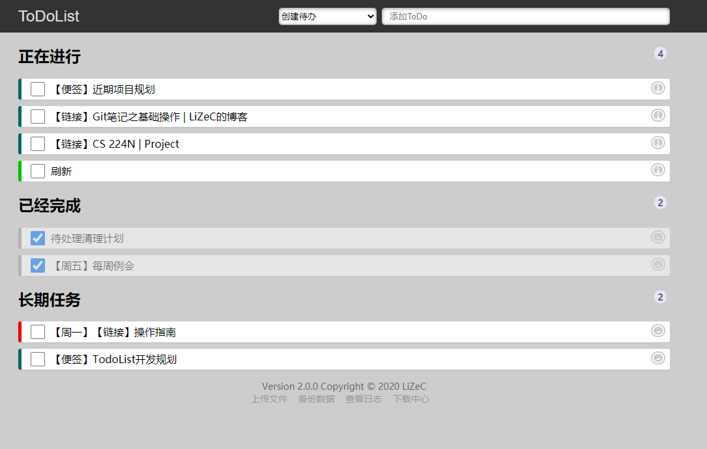

Smart-Todo 待办管理器
========================


Smart-Todo 是一个简单智能的待办事项管理程序. Smart-Todo除了提供基本的创建和删除待办事项功能以外, 还提供自动优先级排序, 离线下载文件, 创建便签等重要的辅助功能.



依赖环境
-------------

本项目基于Python3开发, 请使用Python3.6+的解释器运行本项目. 对于基础功能, 本项目仅依赖Flask, 使用如下指令安装Flask

```bash
pip3 install flask
```

对于高级功能, 本项目还依赖如下的包, 可以根据实际需要选择安装

```bash
pip3 install wget bz4 yagmail
```

各包与功能的对应关系如下表所示

第三方包    | 功能
------------|------------------------------
`wget`      | 离线下载
`bz4`       | 解析HTML结构
`yagmail`   | 发送备份邮件(此功能还处于开发阶段)

在不使用上述的功能时可以不安装这些包, 但还是建议在一开始就安装所有的依赖, 以免后续使用上述功能时出现异常.


基本配置
-------------

Smart-Todo项目可以开箱即用, 在config文件夹中提供了一个默认配置文件(`config/default.json`), 在本地运行或者测试时可以直接使用默认配置.

默认用户名为`admin`, 密码为`123456`. 如果将项目部署在公网, 强烈建议在config文件夹中创建`config.json`文件来覆盖原有配置. 

`config.json`文件与`default.json`同时存在时, 程序为优先加载`config.json`.


基础特性介绍
-------------

### 截止日期

在创建任意类型的任务时, 可以使用`-dl`参数来设置截止日期. 例如

```
写日记 -dl 11.12
周末会议 -dl 3.12:12
```
可以用`11.12`的方式指定日期, 也可以使用`3.12:12`的方式将截止日期精确到当天的中午12时.
如果不指定小时, 则默认为当天的零点, 只需要指定日期, 程序会自动推断年份.

### 特定日期任务

在创建任意类型的任务时, 可以使用`-sp`参数来设置每周的触发时间. 例如

```
周日任务 -sp 7
```

则每周日此任务会自动转换为待办状态. `-sp`后的数字表示一周的第几天, 从周一开始, 且用数字1表示周一.


### 可重复标记

在创建任意类型的任务时, 可以使用`-re`参数来标记为可重复任务. 例如

```
每日看论文 -re
```

标记为可重复任务的项目在标记为完成状态后不会被垃圾收集, 并且在第二天自动变为未完成状态 


### 工作段任务标记

在创建任意类型的任务时, 可以使用`-wk`参数来标记为工作段任务. 例如

```
工作时间的任务 -wk
```

工作段任务在工作时间段会提高展示的优先级, 在非工作时间段会降低展示的优先级.


### 网页书签

在创建待办时, 如果输入一个URL, 则自动将此URL对应的页面的标题作为此待办的标题.
创建完成后, 直接点击这个待办可打开相应的网页.

### 新生代与老年代

系统中的项目可以划分为新生代和老年代. 新生代中的待办事项快速的创建和消亡, 老年代中的任务会保持一段较长的时间.


自动优先级
--------------

如果给定了必要的属性, 程序将自动对任务进行优先级排序.

### 基础概念

1. 两个不具有任何特殊属性的Item之间, 根据创建时间决定优先级, 创建时间越晚, 优先级越高.
2. 所有的优先级算法都通过间接影响创建时间实现优先级的变化. 
3. 一个Item的优先级提高 1 天, 相当于比同时间提交的普通任务晚 1 天提交.

自动优先级算法通过将Item的创建时间以及各种特殊属性影响的时间都转换为浮点数后相加得到总分值, 然后对总分值进行排序实现自动优先级.


### 工作时间段

具有工作时间段属性的任务将会根据当前是否为工作时间段调整优先级, 规则如下

1. 如果现在处于工作时间段, 任务优先级提高 30 天
2. 如果现在不处于工作时间段, 任务优先级降级 30 天

> 工作时间段的定义为 周一到周五 上午9点到下午6点


### 截止日期

创建任务时, 可以设置截止日期. 系统将根据截止日期的远近进行排序. 规则如下

如果现在距离截止日期还有X天, 则任务优先级提高 (56 - 8X) 天

--------

根据截止日期与当前时间, 可以计算出urgent等级, 并依据等级在页面上使用不同的颜色预警. 规则如下

距离截止日期小于1天时, 标记为红色
距离截止日期小于2天时, 标记为橙色
距离截止日期小于3天时, 标记为黄色
距离截止日期小于4天时, 标记为蓝色

-----------

此算法应该满足如下的约束条件

1. X>7时, 优先级降低
2. X=7时, 优先级不提高也不降低
3. X>3时, 优先级一定程度提高
4. X=3时, 优先级至少提高 30 天, 从而比工作任务优先展示
5. 函数应该尽可能平滑, 不存在间断点

> 使用线性插值是满足上述条件的最简单方案

### 特定任务 

特定任务在每周的特定的一天触发, 属于最高优先级的任务. 
特定任务触发时, 会在当前时间的基础上将优先级提高 100 天
 

文件控制
------------

文件是一种特殊类型的Item, 点击文件类型的Item后, 会自动从服务器下载此文件.

### 离线下载文件

选择文件下载类型, 输入需要下载的文件URL, 服务器将下载指定的文件, 并创建一个文件标记的Item.

### 本地上传文件

点击上传文件, 选择需要上传的文件, 文件将会上传到服务器, 并且生成一个文件标记的Item.

> 通过上传和下载可以实现文件中转功能 

### 文件生命周期

- 无论是上传的文件还是下载的文件, 都与Item的生命周期绑定
- 当Item被删除时, 相应的文件同时被删除


Note系统
--------------

Note是一种特殊的Item, 创建完成后, 点击相应的Item会跳转到一个Note页面
其中包含一个可以编辑的窗口, 可以通过此窗口输入任意的文本内容.

同时, Note页面也可以创建Item, 此处创建的Item只在此页面可见, 是私有的Item
借助于此功能, 可以将一个计划放入一个Note, 并逐步分解为Item.

当Note对应的Item被删除时, Note所包含的全部数据同时被删除(通过类似Java的引用分析来回收资源).

### 保存

在Note页面, 输入的内容会静默的执行自动保存, 每分钟保存一次. 同时也可以使用Ctrl+S手动保存


### 参考 
- [10行 JavaScript 实现文本编辑器](https://segmentfault.com/a/1190000008454793)


类型与属性
---------------------

**以下是本项目的一些开发细节, 非开发者可以不用关注.**

虽然都表现为一个待办项目, 但系统实际上可以按照类型和属性进行划分. 整个系统有三个类型, 即

类型    | 含义
--------|--------------------------------
single  | 普通的待办项目
file    | 离线下载或者上传的文件
note    | 创建的便签

与此同时, 还有一个平行的属性系统, 系统中具有如下的一些属性

属性        | 含义
------------|--------------------------------
deadline    | 截止时间
sp/re/work  | 是否为 特殊/可重复/工作 任务
old         | 是否为老年代项目
url         | 项目对应的连接

任意一个项目只能具有一个类型, 但可以拥有任意数量的属性.


指令系统
-----------------

系统提供了一个简单的指令系统来实现高级功能, 例如动态的修改Item的属性.

### 事务模式

由于指令系统可以执行任意有意义的指令, 因此有可能出现输入错误导致系统无法正常运行的问题.
因此可以在执行指令之前开启事务模式, 确认指令执行效果后再提交或者回滚.

如果重复启用事务, 则前一个事务的操作自动回滚. 
如果启用事务后一小时仍然没有提交或者回滚事务, 则自动回滚

### 指令格式

对于大部分操作而言, 本质上是重新设置某个属性, 因此设置属性的指令的格式为

```
set <name1>, <name2>, <name3> -> <attr1>, <attr2> = <value1>, <value2>
```
- `<name>`是Item的任意一部分文字片段, 要求选择的文字片段具有唯一性.
- `<attr>`是属性名称, 支持简写. 对应关系参考`service4interpreter.py/attr_name_map`
- `<value>`是设置的属性, 支持None/True/False等字面量以及日期
- `<value>`部分支持以文字片段的方式代替id, 此时需要将文本放在`< >`之中

例如
```
读书笔记->p = <读书计划>
```
将会把包含文字`读书笔记`的Item的parent属性的值设置为包含文字`读书计划`的id
通过这样的指令, 可以将一个全局创建的Item移动到一个Note中

-----------------


对于少部分操作, 需要分为多个步骤来设置属性, 为了简化这部分操作, 本项目提供了一些内置的函数来直接完成相关的操作. 

通过调用这些函数, 能够简单的完成一些需要多步骤的复杂操作

指令格式为

```
func <function_name> <arg>
```

函数                      | 含义
-------------------------|------------------------------------------------
`func public <name>`     | 将包含`<name>`指定的字符串的Item文件移动到公共空间


### 高级操作

由于系统会自动回收没有引用的Item, 因此可以将一个Item的parent字段设置为一个不存在的id,
则此Item由于没有引用, 将会在下次垃圾回收时被删除.


开发说明
---------------

### 调试时间模式

在项目中创建一个名为`database/time.debug`的文件, 并写入一个标准的时间格式字符串, 例如

```
2020-6-26 18:58:29
```

在程序启动时, 如果检测到此文件存在, 则所有关于时间的API都会返回此文件制定的时间. 此操作支持动态加载, 因此在需要调试时间相关的问题时, 可以利用此机制实现时间的任意切换.


### 多用户模式

我希望这个程序保持简单, 因此并没有考虑太多权限控制相关的内容. 这个项目虽然支持多用户, 但并没有对多用户之间做完全的隔离, 因此不能保证一个用户不会看到另一个用户创建的待办事项.

如果当前只有一个用户, 那么就不存在任何问题了.


### 版本号

当前版本为2.0, 基于一般的版本号约定, 此程序应该在大版本号相同时保持兼容, 但我并没有测试这一点. 
但可以肯定的是, 大版本号不同时, 肯定不兼容.
