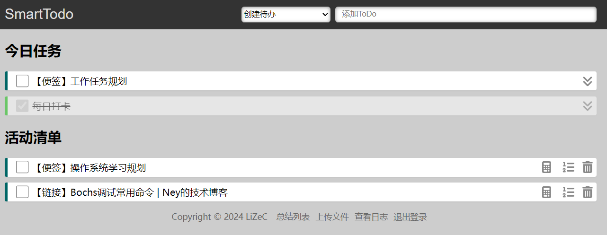

Smart-Todo 待办管理器
========================


[中文][[English](https://deepwiki.com/LiZeC123/SmartTodo)]

Smart-Todo是一个简单智能的待办事项管理程序. Smart-Todo提供了创建和删除待办事项的基础功能, 并在此基础上提供自动优先级排序, 离线下载文件, 创建便签等重要的辅助功能. 

得益于人工智能技术的发展, 本项目也引入了AI辅助能力, 在和AI助理对话的过程中会自动注入代办事项相关的信息(今天的规划, 完成情况等), 从而每次都可以获得与当天事项紧密相关而又独特的对话. 此外也可以利用人工智能对项目的优先级进行动态调整.




- [Smart-Todo 待办管理器](#smart-todo-待办管理器)
  - [项目部署](#项目部署)
    - [本地构建镜像](#本地构建镜像)
    - [部署说明](#部署说明)
  - [基本配置](#基本配置)
    - [配置日报推送](#配置日报推送)
    - [大语言模型配置](#大语言模型配置)
  - [基础特性介绍](#基础特性介绍)
    - [网页书签](#网页书签)
    - [垃圾回收](#垃圾回收)
  - [番茄工作法](#番茄工作法)
    - [番茄组规划](#番茄组规划)
  - [设置附加属性](#设置附加属性)
    - [截止日期](#截止日期)
    - [设置标签](#设置标签)
    - [每日任务](#每日任务)
    - [(已废弃)周期任务](#已废弃周期任务)
  - [自动优先级](#自动优先级)
    - [基础概念](#基础概念)
    - [截止日期](#截止日期-1)
    - [语义评分](#语义评分)
    - [特定任务](#特定任务)
  - [文件系统](#文件系统)
    - [离线下载文件](#离线下载文件)
    - [上传文件](#上传文件)
    - [生命周期](#生命周期)
  - [便签系统](#便签系统)
    - [富文本编辑](#富文本编辑)
    - [子任务拆分](#子任务拆分)
  - [AI私人助理](#ai私人助理)
    - [核心架构](#核心架构)
    - [双模式工作](#双模式工作)
    - [多角色系统](#多角色系统)
    - [记忆系统](#记忆系统)
    - [流言蜚语](#流言蜚语)
    - [上下文注入](#上下文注入)
    - [工具调用](#工具调用)
    - [Web 端功能](#web-端功能)
    - [成本监控](#成本监控)
    - [定时任务](#定时任务)
  - [指令系统](#指令系统)
  - [开发指引](#开发指引)
    - [开发环境推荐](#开发环境推荐)
    - [插件推荐](#插件推荐)
  - [开源项目和组件](#开源项目和组件)
  - [参考资料](#参考资料)
    - [Vue.js](#vuejs)
    - [JavaScript](#javascript)
    - [Font Awesome](#font-awesome)
    - [音效素材](#音效素材)
    - [文本编辑器实现](#文本编辑器实现)


项目部署
-------------

本项目已经支持Docker方式部署, 并且已经在Github提供的镜像托管服务`ghcr.io`上发布了此项目的镜像文件. 当前可使用docker-compose一键部署, 将如下的内容保存为`docker-compose.yml` 

```yml
services:
  todo:
    container_name: smart-todo
    image: ghcr.io/lizec123/smart-todo:latest
    environment:
      TZ: Asia/Shanghai
      ENV: PROD
    ports: 
      - "8080:80"
    volumes:
      - ./config:/app/config
      - ./data:/app/data
```

执行如下命令即可拉取并在后台运行服务

```bash
docker-compose up -d
```

---

注意: ENV变量指定的服务所在环境, 为了避免意外执行定时任务产生额外费用, 对于非`PROD`环境(或者没有设置ENV变量的环境)不执行可能产生费用的LLM相关定时任务. 具体信息可查看`backend/app/__init__.py`中定义的定时任务.

### 本地构建镜像

如果无法访问`ghcr.io`, 则可以将此项目clone到本地后, 手动执行如下的命令在本地构建镜像

```
docker build . --file docker/Dockerfile --tag ghcr.io/lizec123/smart-todo
```

镜像构建成功后, 可继续使用上述的`docker-compose.yml`文件启动服务. 此时由于本地已存在目标镜像, 将会自动使用本地的镜像.

### 部署说明

项目默认在8080端口提供服务, 可通过修改`docker-compose.yml`文件修改项目配置. 


基本配置
-------------

本项目在config文件夹中提供了一个默认配置文件(`config/default.json`), 在本地运行或者测试时可以直接使用默认配置.

默认提供了两个测试用户, 信息如下

| 用户名  | 密码     | 权限                      |
| ------- | -------- | ------------------------- |
| `admin` | `123456` | `ROLE_ADMIN`, `ROLE_USER` |
| `user`  | `123456` | `ROLE_USER`               |

其中`user`用户仅拥有普通权限, 仅能够普通的使用系统的基本功能, 而`admin`用户具有管理员权限, 除了普通的使用系统外, 还可以查看系统日志, 执行特殊指令.

如果将项目部署在公网, 建议在config文件夹中创建`config.json`文件来覆盖原有配置.  即当`config.json`与`default.json`同时存在时, 优先加载`config.json`.


### 配置日报推送

一个完整的用户配置如下所示：

```json
    "user": {
      "password": "123456",
      "email": "user@example.com",
      "role": ["ROLE_USER"],
      "qw_hook": "https://qyapi.weixin.qq.com/cgi-bin/webhook/send?key=xxxx-xxxx"
    }
```

其中`email`字段和`qw_hook`字段可选填, 当`email`字段字段非空时, 用户的日报和周报会推送到该邮箱. 当`qw_hook`字段非空时, 用户的日报和周报会推送到该企业微信机器人.

关于企微微信机器人的配置, 可参考[官方文档](https://developer.work.weixin.qq.com/document/path/91770)

### 大语言模型配置

大语言模型部分的配置信息如下

```json
  "LLM_INFO": {
    "BASE_URL": "https://api.siliconflow.cn/v1",
    "API_KEY": "sk-xxx",
    "MODEL_NAME": "deepseek-ai/DeepSeek-V4-Flash"
  },
```

其中`BASE_URL`是模型提供方的接口地址, `MODEL_NAME`是调用模型的名称, 该接口需要兼容OpenAI协议, 在大部分模型提供商的文档中可以找到对应的地址. `API_KEY`是调用模型的账号的私钥. 

> 重要提示: 本项目本身不提供任何大语言模型能力, 所有相关功能均需调用如上配置的第三方大语言模型接口实现. 因使用过程中需将相关数据发送至对应模型提供商的服务器, **启用相关功能前务必自行评估数据敏感性及数据安全风险**

基础特性介绍
-------------

直接在标题栏输入代办事项的标题即可创建一个基础的代办事项. 创建时必须选择任务的重要程度, 可选的等级与默认截止时间如下

| 任务类型 | 默认截止时间 |
| -------- | ------------ |
| 高优任务 | 当天24点     |
| 普通任务 | 当前时间+3天 |
| 低优任务 | 当前时间+7天 |

> 截止时间和重要程度是衡量任务优先级的重要参数, 因此必须在创建任务时就确定, 否则后续难以补回, 导致大量没有明确优先级的任务积压


### 网页书签

在创建待办时, 如果输入为一个URL, 则自动将此URL对应的页面的标题作为此待办的标题. 同时左键点击此待办事项可以直接跳转到对应的页面, 右键单击此待办事项可以按照Markdown格式复制标题和对应的URL

此功能可用于临时保存某个需要后续查看的网页, 或者需要将该网页在Markdown格式的博客中引用的场景.


### 垃圾回收

对于标记为已完成的待办事项, 在每天凌晨会自动被删除. 


番茄工作法
--------------

本项目支持使用[番茄工作法](/doc/番茄工作法.md)来管理和完成任务. 本项目提供了两个任务列表, 即"活动清单"和"今日任务". 位于活动清单中的任务是等待被完成的任务, 根据其重要性与截止日期, 活动清单中的任务按照优先级进行排序. 

活动清单中的任务可以设置预期的番茄钟数量, 每个任务最多可设置需要四个番茄钟. 如果一个任务无法在四个番茄钟内完成, 则说明该任务过于庞大, 需要进行拆分. 完成规划后可将活动清单中的任务添加到今日任务列表中.

从个人实际体验上看, 合理的规划和设置番茄钟数量能有效地保证工作强度不至于过高又能较为专注的完成最重要的任务.

---

位于今日任务列表中的任务是预期在今日完成的任务, 其中的任务按照添加顺序排列, 即最先添加的任务排列在列表的最前面. 点击标题部分的"今日任务"跳转至番茄钟页面. 


在番茄钟页面可查看当前用户所有的今日任务, 并可选择其中的一项任务启用番茄钟. 启动番茄钟后, 将自动开始25分钟的工作倒计时. 工作倒计时结束后, 将会自动将该任务的完成计数加一, 播放音乐提示用户并进入5分钟的休息倒计时.

如果该任务具有多个番茄钟, 则会连续地执行工作25分->休息5分钟的循环, 直到该任务的所有番茄钟均已完成. 由于单个任务最多设置四个番茄钟, 因此一次最多连续工作大约2小时, 正好对应一个大组的番茄钟.

> 注意: 倒计时结束依赖Web端检测, 因此需要确保番茄钟页面处于活动状态. 例如在移动端浏览器进入后台后, 页面就可能不处于活动状态.

### 番茄组规划

每日除了按照番茄钟进行划分以外, 还可以将若干番茄钟组合为一个番茄组, 在组与组之间增加一段较长的休息时间. 当前按照如下的方式构造番茄组

| 时段     | 起止时间      | 番茄钟数量 |
| -------- | ------------- | ---------- |
| 早间     | 7:00 ~ 9:20   | 自由安排   |
| 上午     | 9:20 ~ 11:20  | 4个        |
| 午间     | 11:20 ~ 14:20 | 自由安排   |
| 下午1    | 14:20 ~ 16:20 | 4个        |
| 下午休息 | 16:20 ~ 16:40 | 中间休息   |
| 下午2    | 16:40 ~ 17:40 | 2个        |
| 晚间     | 17:40 ~ 19:00 | 自由安排   |
| 晚上     | 19:00 ~ 20:00 | 2个        |
| 晚上sp   | 20:00 ~ 21:00 | 自由安排   |


设置附加属性
--------------

在创建代办事项时, 支持使用如下的参数为代办事项附加额外的属性. 

### 截止日期

在创建任意类型的任务时, 可以使用`-dl`参数来设置截止日期. 例如

```
写日记 -dl 11.12
周末会议 -dl 3.12:12
```
可以用`11.12`的方式指定日期为11月12日, 也可以使用`3.12:12`的方式将截止日期精确到3月12日中午12点.

如果不指定小时, 则默认为当天的零点. 不需要指定年份, 程序会自动推断未来一年内最接近的日期, 从而在12月时如果有在下一年截止的任务无需特殊处理.

----------------------

除了明确指定某个日期以外, 还可以通过类似`W<N>`的方式指定截止时间为一周中的某一天. 例如

```
写日记 -dl W2
周末会议 -dl W5
```

如果当前是周三, 则W2表示下周二, W5表示本周五.

> 代办事项的截止日期是影响该事项排序的重要指标之一, 将决定该事项在列表中展示的先后位置. 虽然所有任务均会根据优先级默认设置截止日期, 但依然鼓励手动设置精确的截止日期


### 设置标签

在创建代办事项时, 可使用`-tag`参数来设置标签. 例如

```
上班打卡 -tag before
```

标签为代办事项附加额外的语义信息, 并且如下的一些tag将产生特殊效果

| 标签名 | 效果                                       |
| ------ | ------------------------------------------ |
| before | 此标记任务进入今日事项后将位于所有任务之前 |
| lunch  | 此标记任务进入今日事项后将位于午餐时段展示 |
| dinner | 此标记任务进入今日事项后将位于晚餐时段展示 |
| after  | 此标记任务进入今日事项后将位于所有任务之后 |


### 每日任务

在创建代办事项时, 如果以`每日`开头, 则会询问是否创建每日任务, 例如

```
每日看论文
```

每日任务在标记为完成状态后不会被垃圾收集, 并且在第二天会自动变为未完成状态的今日任务.

### (已废弃)周期任务

在创建任意类型的任务时, 可以使用`-sp`参数来创建一个周期任务. 例如

```
每周任务 -sp 7
```

周期任务在标记为完成状态后不会被垃圾收集. 在每日凌晨会检查所有处于已完成状态的周期性任务, 重置该周期性任务的的状态为未完成状态, 并自动将任务的截止日期增加`-sp`参数所指定的天数.

例如当前示例上`-sp`后的数字为7, 就相当于每周执行一次.

> 建议与`-dl`参数配合使用, 如果当前任务并未指定截止时间, 则第一次增加截止时间时, 以当前时间作为截止时间


自动优先级
--------------

如果给定了必要的属性, 在任务列表中的代办事项将自动进行排序, 从而使用户能够更好的决策各类代办事项的处理顺序.

### 基础概念

两个不具有任何特殊属性的代办事项之间, 根据创建时间决定优先级, 创建时间越早, 优先级越高. 使用此规则时, 越早创建的任务在活动清单中的位置越靠前. 从而减少任务沉底导致的长期处于不被考虑执行的问题.

本项目中所有的优先级排序算法都是通过间接影响创建时间实现优先级的变化, 算法将各种代办事项的影响因素转换为浮点数后与该代办事项的创建时间相加得到总分值, 然后对总分值进行排序实现自动优先级.


### 截止日期

创建任务时, 可以设置截止日期. 系统将根据截止日期的远近进行排序. 规则如下

如果现在距离截止日期还有X天, 则任务优先级提高 (56 - 8X) 天. 该规则的产生原因可见[文档的算法分析部分](/doc/开发细节.md#优先级算法原理分析)

根据截止日期与当前时间, 可以计算出紧急等级, 并依据等级在页面上使用不同的颜色预警, 规则如下(类似于天气预报系统的颜色规则)

| 颜色 | 截止日期            |
| ---- | ------------------- |
| 红色 | 距离截止日期小于1天 |
| 橙色 | 距离截止日期小于2天 |
| 黄色 | 距离截止日期小于3天 |
| 蓝色 | 距离截止日期小于4天 |


### 语义评分

在启用LLM相关配置后, 可开启语义评分模块, 将在现有的优先级计算的基础上附加一个LLM模型给出的分数, 从而更细致的调整代办事项的优先级.

> LLM服务需要用户自行配置SK并评估数据安全风险.

### 特定任务 

特定任务在每周的特定的一天触发, 属于最高优先级的任务. 特定任务触发时, 会在当前时间的基础上将优先级提高 100 天


文件系统
------------

### 离线下载文件

在创建代办事项时, 如果输入的内容是一个文件的URL路径, 则服务将会在后台下载对应的文件, 并创建一个与文件名相同的代办事项. 下载完毕后, 左键单击此代办事项将会触发下载操作.

> 这相当于一个离线下载功能, 可用于临时下载某些小文件

注意: 后台会根据URL的后缀推断是否是一个文件. 如果不是文件则会按照网页书签逻辑进行处理.


### 上传文件

除了从URL下载外, 点击页面底部的`上传文件`按钮, 也可以从本地上传一个文件到服务器. 上传的文件会在服务器上生成一个URL路径, 任何人都可以通过该路径获取到对应的文件.

> 此功能可以临时的将某个文件发布到互联网. 也可以通过上传和下载实现文件中传. 由于文件完全公开, 因此不建议上传涉及隐私的文件.


### 生命周期

无论是上传的文件还是下载的文件, 都与代办事项本身的生命周期绑定, 即当对应的代办事项被删除时(无论是手动删除还是垃圾回收删除), 相应的文件也会同步的在服务器上被删除.


便签系统
--------------

### 富文本编辑

便签是一种特殊的待办事项, 在创建代办事项时, 如果名称以`计划`, `规划`, `事项`, `分析`, `笔记`等词汇结尾, 则会询问用户是否需要创建一个便签类型的代办事项.

创建完成后, 点击该待办事项会跳转到一个新的页面之中. 此页面提供一个可以编辑的文本框, 该文本框可输入任意文本内容并支持使用如下的快捷键设置一些特殊样式.

| 快捷键 | 效果       |
| ------ | ---------- |
| C+b    | 黑体       |
| C+i    | 斜体       |
| C+u    | 下划线     |
| C+d    | 删除线     |
| C+1    | 一级标题   |
| C+2    | 二级标题   |
| C+h    | 插入分割线 |

> 对于Win平台, C表示`Ctrl`键, 对于Mac和Linux平台, C表示`Ctrl`键或`Cmd`键

在便签页面, 输入的内容会静默的执行自动保存, 每分钟保存一次. 也可以使用`C+S`快捷键, 或者点击Note编辑框右上角的"保存文档"按钮手动保存文档内容.


### 子任务拆分

在便签页面内也可以创建其他代办事项, 这些待办事项仅在此便签页面内可见. 因此便签相当于开启了一个子空间. 借助于此功能, 可以将一个复杂的计划拆分为更细致的子任务, 从而更细致有效地管理待办事项.

当便签被删除时, 便签内所包含的全部数据同时被删除, 即该便签内记录的全部文本内容和代办事项将同时被删除.


AI私人助理
----------------

本项目内置了一个 AI 私人助理系统，通过与配置的大语言模型交互，提供智能化的待办事项管理辅助。助理界面通过 Web 端的"私人助理"页面访问，后端核心逻辑位于 `backend/app/services/llm_manager.py`。

### 核心架构

AI 助理由三个核心模块组成：

- **AssistantHistoryManager**：管理聊天历史的存储与查询，支持多角色对话隔离、消息撤回、按时间范围查询历史记录等功能。
- **AssistantMemoryManager**：管理长期记忆，通过记忆压缩机制将历史对话提炼为结构化记忆（角色设定、用户偏好、近期话题、个人日记），并支持跨角色的流言蜚语传播。
- **AssistantManager**：主控制器，协调 LLM 调用、工具执行、上下文注入、流式响应生成等核心流程。

### 双模式工作

助理支持两种工作模式，可通过 `/change_mode` 指令切换：

| 模式     | 说明                                                                                               |
| -------- | -------------------------------------------------------------------------------------------------- |
| 助理模式 | 注入番茄钟状态、事件日志等系统上下文，支持工具调用（创建待办、查询其他角色信息），适合任务管理场景 |
| 扮演模式 | 不注入任何系统信息，仅基于角色设定进行对话，适合角色扮演场景                                       |

### 多角色系统

系统支持多个助理角色共存，每个角色拥有独立的：
- 角色描述和系统提示词
- 记忆策略（可配置是否启用角色设定、用户偏好、近期话题、日记等记忆项）
- 聊天历史记录
- 记忆压缩策略（通过 `memory_policy` 配置，设为 `None` 可关闭自动压缩）

使用 `/switch <角色名>` 可在不同角色间切换，使用 `/role_list` 查看所有可用角色。

### 记忆系统

助理会在对话过程中自动积累对用户的了解，记忆分为以下几类：

| 记忆类型      | 说明                                           |
| ------------- | ---------------------------------------------- |
| 角色设定      | 从对话中提炼的用户对角色行为的设定和期望       |
| 用户偏好      | 从对话中推断的用户偏好和行为模式               |
| 近期话题      | 近期讨论过的话题摘要                           |
| 个人日记      | 按天总结的用户行为和对话要点                   |
| 固定设定/偏好 | 用户手动设置的、不会被自动压缩覆盖的持久化设定 |

当原始对话内容超过最小压缩阈值时，系统会自动调用 LLM 将历史对话压缩为结构化记忆，同时动态调整原始对话的保留窗口。用户也可使用 `/set_memory` 手动设置固定记忆，使用 `/memory` 查看当前生效的记忆，使用 `/set_time` 调整原始对话保留的起始时间。

### 流言蜚语

系统支持跨角色的"流言蜚语传播"机制：每天定时汇总各角色的日记，生成一份客观的用户全天行为描述，供所有角色共享。这使不同角色之间能够了解用户与其他角色的互动情况。使用 `/rumor` 指令可将流言蜚语注入当前对话。

### 上下文注入

在助理模式下，每条用户消息会自动注入以下系统上下文：
- **番茄钟状态**：当前是否在进行番茄钟、所处的工作/休息阶段、剩余时间
- **事件日志**：自上次助理模式对话以来的番茄钟记录变更
- **休息时间检查**：午间（11:30-14:30）、晚间（17:30-19:00）、深夜（21:00后）休息时段识别

这确保助理始终了解用户当前的工作状态，能够给出更具针对性的建议。

### 工具调用

助理模式支持 Function Calling，当前提供两个工具：

| 工具          | 功能                                                                    |
| ------------- | ----------------------------------------------------------------------- |
| `create_item` | 根据对话内容创建待办事项，支持设置名称、截止日期、优先级                |
| `query_info`  | 向其他角色发起查询，获取跨角色的信息（由对应角色的 LLM 基于其记忆回答） |

### Web 端功能

前端聊天界面 (`web/src/view/Assistant.vue`) 提供：
- 流式对话展示，支持实时打字效果
- 指令系统，输入 `/` 触发自动补全，支持键盘上下选择
- 历史记录按天分割展示，已压缩的对话与原始对话之间以分割线标识
- 向上滚动自动加载更多历史记录
- 按 `Esc` 可中断正在生成的回复
- 支持移动端适配

### 成本监控

使用 `/cost` 指令可按角色查看会话成本，包括记忆字符数、对话字符数、对话轮数和预计 Token 数，以及最近 14 天的每日成本明细。

### 定时任务

在生产环境下，系统每日自动执行记忆压缩任务：遍历所有用户的所有活跃角色，对符合压缩条件的角色执行长期记忆更新，并基于当日日记进行流言蜚语传播。非生产环境（`ENV` 不为 `PROD`）不执行此任务以避免不必要的 LLM 调用费用。


指令系统
----------------

本项目支持在待办事项输入框中输入`func`开头的指令, 来执行一些系统层次的操作或者一些较为少用的代办事项类操作. 指令系统仅对管理员权限的用户开放. 不当使用指令系统可能导致数据丢失或状态异常等问题, 请谨慎操作. 

指令系统的具体内容, 可参考[文档](/doc/指令系统.md)


开发指引
----------

如果对开发本项目感兴趣, 可以阅读本节了解开发细节

### 开发环境推荐

1. 使用Window的PC进行开发, 存在下载依赖困难, 命令行使用不方便的问题. 但可以使用功能较为强大的IDE, Pycharm和WebStorm均可以非商业使用.
2. (**推荐**)使用CodeSpace相对来说最便捷, 同时可以方便的跨端开发. 仅需要保证可以正常连接到Github即可.
3. (**不推荐**)使用云服务器进行开发, 国内机器存在下载依赖困难的问题, 海外机器存在连接困难的问题. 既浪费钱又不实用.

### 插件推荐

如果使用Vscode开发, 推荐安装如下的插件

1. Python: Python开发基础插件
2. Vue-Official: Vue开发基础插件
3. Live Server: 启动本地Web服务, 用于查看代码覆盖率报告


开源项目和组件
----------------

感谢以下的开源项目和免费组件:

- [网站ico图标来源](https://icon-library.com/icon/todo-list-icon-13.html)
- [svg转ico工具](https://www.aconvert.com/cn/icon/svg-to-ico/)

 
参考资料
--------------

### Vue.js
- [Vue.js——60分钟快速入门](https://www.cnblogs.com/keepfool/p/5619070.html)
- [使用 axios 访问 API](https://cn.vuejs.org/v2/cookbook/using-axios-to-consume-apis.html)

### JavaScript

- [使用 Web Notifications](https://developer.mozilla.org/zh-CN/docs/Web/API/Notifications_API/Using_the_Notifications_API)

### Font Awesome

- [Font Awesome图标查询](https://fontawesome.com/v5.15/icons?d=gallery&p=2&s=regular,solid&m=free)
- [Vue中使用Font Awesome](https://github.com/FortAwesome/vue-fontawesome)

### 音效素材

- [站长素材](https://sc.chinaz.com/yinxiao/)

### 文本编辑器实现

- [10行 JavaScript 实现文本编辑器](https://segmentfault.com/a/1190000008454793)
- [自己动手实现简易的div可编辑富文本框及按下tab键后增加4个空格功能](https://blog.csdn.net/Clark_Fitz817/article/details/79316037)